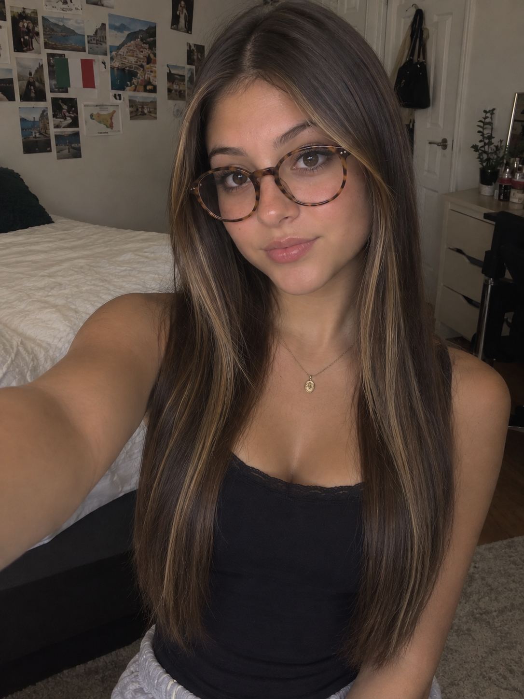
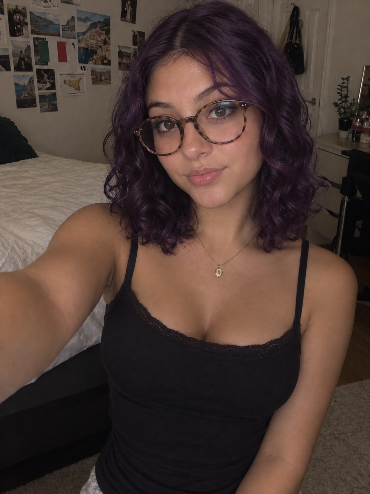

# Week 3 – Selfie & Identity

## The Artifact
First Image (Description of user)

Second Image (Changed made after first image created)

## Process Notes
*How did you make this?*
I used ChatGPT to create an image that, in it's original idea, represents me. I used words in a prompt that describes myself. For the second image I was able to change anything I wanted so, I chose to give myself short, curly and purple hair (as seen in the image above).

*What tools did you use?*
I mainly used ChatGPT. I also tried to use Google Gemini, but the image was not what the assignment called for. 

*What decisions did you make?*
I was able to choose how I wanted to describe my desired person. I was also able to choose which AI tool to use. The class mainly was using ChatGPT but it was not limited to that tool. In the edited verson of the image (The second image generated) I was able to use my imagination and add any sort of changes I wanted to. In my edited verson, I gave myself short, curly, purple hair. 

## Reflection
*Where do you see yourself in the image — and where do you not?*

I see myself in certain aspects of the photo. For example the glasses and nose are pretty accurate along with the hair color and highlights. I think that this is almost accurate but something is just slightly off when looking at the photo. I think that the main thing that is sticking out that is different to me is the individuality that a person has. This photo that has been generated fits all the boxes of what makes someone stereotypically pretty. It fits all the beauty standards that most people can't fit naturally. This shows us how integrated these standards are into the media: AI takes from our ideas and the media/internet => so based on this one can tell what in trending and what people find “attractive”. Another thing that sticks out to me is the lack of emotion behind the eyes. This makes sense because it was generated by a computer but it almost looks uncanny valley because it looks so real but there are no thoughts behind the eyes in the photo. I think that this is the central difference between humans and AI. The lack of human emotions/connection is what makes us human. Without our emotions, we are just shells of people. We can connect this to our last reflection very clearly. I really enjoyed seeing what would come up in the photo and how we can alter the image to get it to look as close to as us as possible. 

## Attribution & AI Use
- Tools used: Chat GPT

- AI prompts (summary): 

First prompt: create a selfie of a 19 year old Italian/Sicilian american woman. She is 5'2 and 120 pounds. She has brown hair with caramel, face-framing highlights, and her hair goes down to her mid-back. her hair is fine and straight. She has a round face with round features: eyes, a round, buttonish nose, and thinish lips. She also wears circular glasses that are tortoise colored.

Second prompt: Use the exact same image. Do not change anything execpt giving this person short curly hair that is purple. 

- What AI generated: Two images of a person that was described to it

- What you changed or decided: In the second image, I gave myself short, curly, purple hair. 
