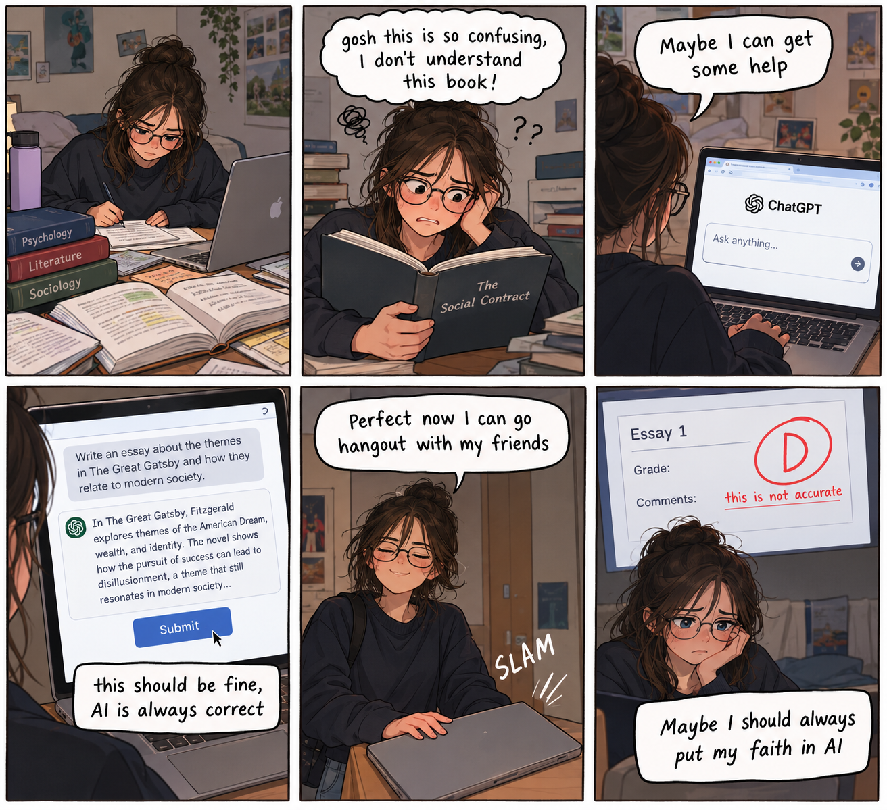

# Week 4 – Comic & Storytelling

## The Artifact
The activity for this week was to create a comic with AI that demonstrated a storyline within 6 panels. I created a comic that focused students trust of AI without fact checking the data that they are given.

## Process Notes
How did you make this?

I used ChatGPT to generate a comic based on the story that it was given. I used descriptive words to create the story how I wanted. I also created my own captions that where used. 

Below is a short templet of what I would do for one panel: 

create a comic strip for me:

      Panel 1

     Description of story

     Captions: Description of caption 

What tools did you use?

I used ChatGPT for the makeing of the comic. I was able to use a drawing app called "Procreate" to add any changes in coloring or texture that I wanted. For example, there was no name for the AI model used so I added ChatGPT in just for fun. 

What decisions did you make?

I was able to make choices in what the story actaully was and the captions that went along with it. This is key because it means that I was essentially in control of the beginning, middle, and end of what was provided to me from the AI. I also had teh ability to edit the image after it was generated. I could change anything that I didn't feel represented my story. 

## Reflection
Reflect 4: Is AI a collaborator, tool, or plagiarist in storytelling?

## Attribution & AI Use
- Tools used:
- AI prompts (summary):
- What AI generated:
- What you changed or decided:
