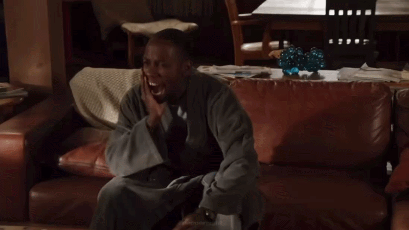

# Week 5 – GIF & Remix Culture

## The Artifact

## Process Notes
How did you make this? 

In order to get a scene from a show, I screen recorded the scene I wanted. Then I saved the video to my files on my phone and saved it to my computer. From there, I went into the EZGIF website and uploaded it. From there it generated the traditional GIF look that we know now. 

What tools did you use? 

I used the website EZGIF this website takes already existing videos and allows you to upload them and generage a GIF from previous pop culture momements. 

What decisions did you make? 

I made many decisions in this process, firtly, I cut down a scene and made it have a looped/repeated effect. I also made it have a smoother effect rather than the scene being fragmented between frames.

## Reflection
Reflect 5: How does AI alter authorship and remix culture? Who owns AI-made art?

AI alters authorship and remix culture because it is becoming easier and easier for people to change things, and make it impossible for copyright actions to take place. This means that there is a possibility for many different versions of the same idea to be present, and we lack the knowledge about what is authentically human or not. Instead of having humans as the soul creators, we drop into an editor position, and AI moves towards the producer. I think that, while yes, AI is incredibly helpful when prioritizing speed and efficiency, it can distort what we know as art and creative liberty. This ties into the topic of who owns AI-made art. AI-made art is technically owned by no one. This is because you cannot get a copyright for an image that is generated purely by artificial intelligence. So, based on this logic, one can say that no one owns it because everyone owns it. This creates a complex discussion about whether the user creating the image should own it, or whether the chatbot- the thing that is actually generating the image that is being used. 

What changes when an image repeats instead of standing still?

You are able to really specify on one meaning. You can focus on the emotions of the people/things in the GIF and then it can apply to many different situations that you might not be able to apply to with the original scene. 

How does looping affect attention, meaning, or emotion?

Looping can make my attention span feel longer even though it is probably the same because the thing that is being viewed is shorter than something that we are used to. It can also make it easier for it to apply to many different situations because it is such a short scene. People can interpret the meaning for themselves and the situations they are in. 

Where do you see human choice in your GIF?

My GIF was fully made in my control. I was able to choose what I wanted my GIF to look like; in my case I chose a scene from a TV show. I screen recorded the part I wanted, edited the start and end point of the scene that was chosen. I was also able to have fully control in the website that helped make my already existing scene into a GIF. I used EZGIF to generate what I wanted. I was able to edit the amount of frames I wanted and the size that it would appear as from the users perspective. 

Where do you see automation or pattern?

I see automation/patterns in the fact that many people could take this scene and claim it as their own. Because I didn’t AI for this, it is difficult to claim that things repeat in this because it was created fully with human creativity and knowledge. The only pattern I can potentially see in the website that I used is the fact that all of the uploaded images/videos will have the same style in the output. It is will follow the usual pattern of a fragmented frame by frame creating an almost gitching effect. 

How does AI complicate ideas of authorship or originality?

I think this becomes complicated because anyone can create a GIF without giving copyright credits. This means that people can be sued if the producer of the original scene/creation didn’t want people to use said scene. However, because it lack sounds, people can change certain parts of an image to make sure they cannot have any sort of copyright infringement. In addition to this, many people don’t create GIFs of themselves, so in certain mindsets, one can say that they are stealing ideas. The other side to this is that the person is all the more creative because they are able to see something that wasn’t intended. 

## Attribution & AI Use
- Tools used: EZGIF
- AI prompts (summary): N/A
- What AI generated: N/A, Why was it not used? I chose to not use AI because I was worried that if I used AI the end result would never get to be what I wanted it to be. I had a clear vision of what I wanted my end result to be so I directly went to the source of what could potentially result in the end result I wanted.
- What you changed or decided: I cut down a scene and made it have a looped/repeated effect. I also made it have a smoother effect rather than the scene being fragmented between frames. 
- Sources of any reused material (if applicable): New Girl
