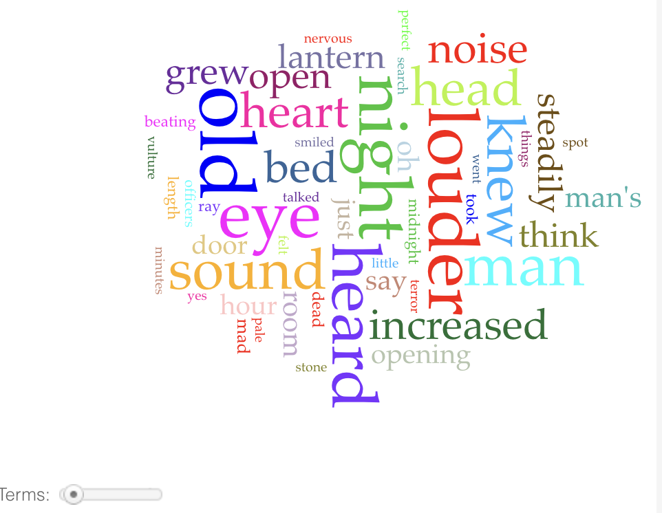
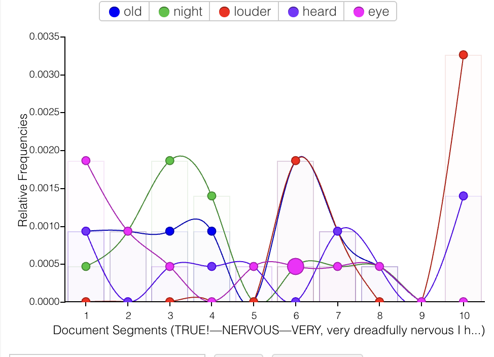

# Week 6 – Text & Distant Reading

## The Artifact
The articact that was made was created with the tool Voyant. Each student in the class was able to choose a piece of literature and then compare Voyant and ChatGPT. We compared what each tool consideres meaning and what is closer to traditional meaning. 

## Process Notes
Voyant Analysis (Summary)

- The analysis that was provided to me from Voyant was focused on the numerical side of the piece that was selected. They took lots of information, such as the word count, which can then have its own side of an analysis; you can look into the reasons why the author used those words as much as they did or even as little as they did. This allows the user to have more of their personal ideas seen in the analysis. Also, to understand the numerical data, you must understand the reading and the meaning behind the author's choices.

GPT Analysis (Summary)

- Prompt: Provide a literary analysis of the text linked above, focusing on themes and imagery.

- The analysis that was provided based on the prompt and the text provided was very analytical and provided insights into themes and imagery that someone may not see right away after the first read. It did a deep dive into “visual and auditory imagery to mirror the narrator's deteriorating mental state,” as well as intense symbolism. The analysis reminded me of a classic English literature course where you are asked to look at the reasoning behind the author's choices. One looks at metaphors, symbolism, juxtaposition, and other literary elements.

Comparison Of Outcomes

- Voyant generated a result from the factual and almost quantitative information that was provided. It used the word count in almost every sort of analysis that was provided; this allows the reader to use their own ideas as to why an author would use this word so much if it was used a lot or vise versa. Included in this, the user/reader must be able to understand the work a little before inputting it into Voyant. ChatGPT required a prompt; you could do the same analysis for word count if you wanted, or you could make it analyse the author's meaning behind certain words or themes. This limits the amount of human work that is incorporated into the work. When someone reads what AI thinks about a text, they start to think like that even if the information doesn’t align with what they were thinking before they asked AI. These differences highlight the motives behind inventors and producers of these tech companies; whether that be ease, productivity, speed, or improved critical thinking.

## Reflection
What do we gain and what do we lose when machines “read” literature for us?

When we have a machine read something for us, we lose our own individuality in an analysis. The analysis that we do regarding certain texts often reflects our own personal experiences, and we can do a deep dive into how these things really impact each other. Without this area of personal experience, we lack an emotional connection. This connection is key when looking at the meaning behind the author's words. In English classes, you tend to look at the history of the author or the time period because this can give one insight into the meaning behind metaphors or just the text in general. However, when we are taking historical context into account, it may be helpful to use AI as a sort of assistant. You can ask questions about the life of the author and the time period that the work was written/produced in. This can be helpful because when you lack knowledge in a certain area, having something to help you can push your analytical skills as long as there isn’t an over-reliance. 

How do Voyant and GPT imagine “meaning” differently?

Voyant imagines meaning as something that is “in front of your face”. It takes the almost obvious information like word count and then the user must find meaning from that information that is given from Voyant. There is also a difference in how you must prompt the AI machines. For Voyant, there is no action of prompting it to do anything. This differs from GPT because you have to tell this machine what to do when analysing the text that you provided it. This means that you can tell GPT what to focus on; for example, imagery and themes of death. When you do this there is a lack of human understanding. 

## Attribution & AI Use
Tools used: 

- ChatGPT and Voyant

AI prompts (summary): 

- Provide a literary analysis of the text linked above, focusing on themes and imagery.

What AI generated: 

- Voyant: A word count and amount of times a word is used that can be analysed in many different forms on graphs

- ChatGPT: An analysis that focused on the themes present in the liturature as well as the imagery. It also told me how they connected to each other. 

What you changed or decided: 

- I was able to choose how I wanted to precieve data (with word count). 
